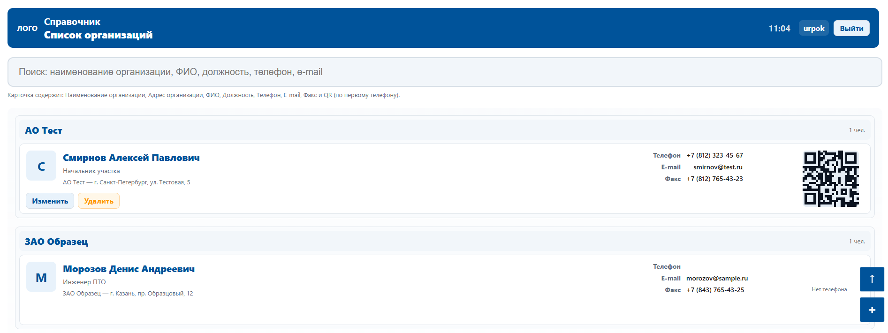

# Телефонный справочник (PHP + LDAP)

## Описание

Данное приложение представляет собой **телефонный справочник**, переписанный на PHP.  
В новой версии реализованы следующие возможности:

- Вход по учетным записям из базы данных (пароли хэшируются).
- Вход по учетным записям из **LDAP** (Active Directory или OpenLDAP).
- Возможность **добавления, редактирования и удаления** контактов из телефонной книги.
- Возможность ограничивать вход только для определённых пользователей.

## Основной функционал

1. **Аутентификация**
   - Через локальные учетные записи в БД (с безопасным хранением паролей с хэшированием).
   - Через LDAP (корпоративные учетные записи).
   - Возможность указать список разрешённых пользователей для входа.

2. **Телефонная книга**
   - Просмотр списка контактов.
   - Добавление новых контактов.
   - Редактирование существующих записей.
   - Удаление записей.

3. **Администрирование**
   - Контроль доступа (ограничение входа).
   - Централизованное хранение данных в PostgreSQL.

## Структура проекта

- `index.php` — главная страница (список контактов).
- `login.php` — форма входа.
- `logout.php` — выход из системы.
- `add.php`, `edit.php`, `delete.php` — управление записями.
- `app/db.php` — подключение к базе данных.
- `app/auth.php` — локальная аутентификация (БД).
- `app/ldap_auth.php`, `app/ldap_config.php` — аутентификация через LDAP.
- `sql/init.sql` — SQL-скрипт для инициализации таблиц.
- `css/` — стили оформления.
- `scripts/` — вспомогательные скрипты (JavaScript).

## Требования

- PHP 7.4+
- PostgreSQL
- Apache/Nginx
- LDAP сервер (для доменной аутентификации)

## Установка

1. Разверните проект на сервере с поддержкой PHP.
2. Создайте базу данных и выполните скрипт `sql/init.sql`.
3. Настройте соединение с БД и LDAP в файле `app/config.php` и `app/ldap_config.php`.
4. Убедитесь, что включено расширение `pdo_pgsql` для PHP.
5. Настройте виртуальный хост (Apache/Nginx) для работы приложения.
